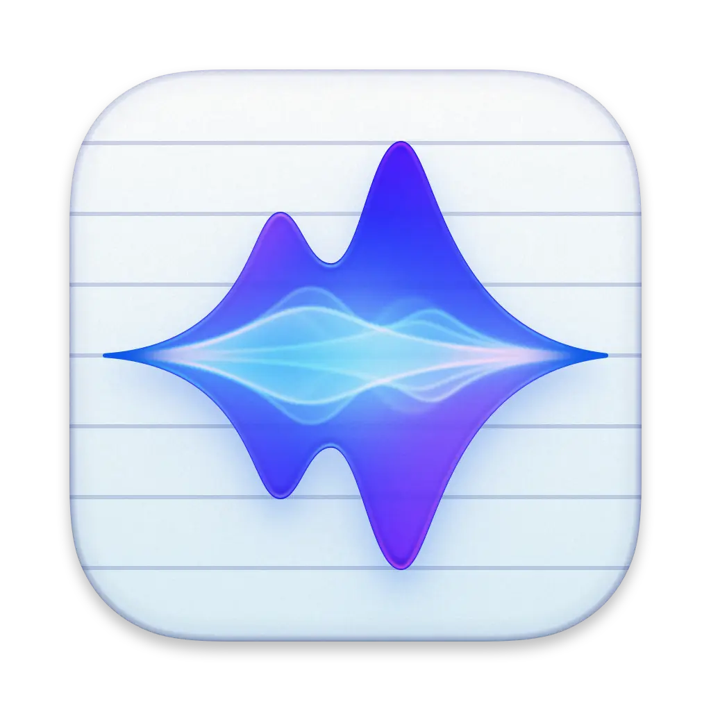

# wysprflow



<p align="center">
  <a href="https://github.com/usmanomer1/wysprflow/releases/latest">
    
  </a>
</p>

Open-source voice dictation for macOS.

`wysprflow` listens while you hold a hotkey, streams speech to text, optionally cleans the transcript with an LLM, and pastes the result back into the focused app.

## Platform

- `macOS 13+`
- Tauri 2 desktop app
- Bring-your-own-provider keys

## What ships today

- Hold-to-talk dictation with a global hotkey
- Deepgram streaming transcription
- Cleanup via OpenRouter or Anthropic
- Clipboard-preserving paste injection
- First-run setup with key entry and permission checks
- Local dictionary, snippets, and run history
- Settings for microphone, sound, startup, translation target, and prompts

## Install

The primary install path for users is the latest macOS release on GitHub:

- [Download the latest macOS DMG](https://github.com/usmanomer1/wysprflow/releases/latest)

If you want to build a local DMG yourself:

```bash
pnpm install
pnpm tauri:build:dmg
```

The DMG will be written under `src-tauri/target/release/bundle/dmg/`.

If you only need the app bundle, use:

```bash
pnpm tauri:build:app
```

That writes `wysprflow.app` under `src-tauri/target/release/bundle/macos/`.

Normal users should install from a download link on the website or GitHub Releases. `npm` / `pnpm` is only for developers working on the source code.

## Install from source

If someone finds the project on GitHub and wants to avoid Apple distribution friction, the developer path is:

```bash
git clone <repo-url>
cd wysprflow
pnpm install
pnpm tauri:dev
```

Or to build a local unsigned app bundle:

```bash
pnpm tauri:build:app
```

This does **not** require paying Apple. Apple Developer membership is only needed for signed/notarized public distribution.

## First Run

1. Move `wysprflow.app` into `Applications` and open it from there.
2. Add a `Deepgram` key and either an `OpenRouter` or `Anthropic` key.
3. Grant `Microphone`, `Accessibility`, and `Input Monitoring`.
4. Test dictation in `TextEdit` or `Notes` by holding `Fn`.
5. If your Mac reserves `Fn` for Emoji or Globe shortcuts, keep the fallback shortcut in Settings.

Detailed user setup is in [docs/install-macos.md](docs/install-macos.md).

## Provider status

| Provider | Role | Status |
| --- | --- | --- |
| Deepgram | speech-to-text | live |
| OpenRouter | cleanup | live |
| Anthropic | cleanup | live |
| Groq | future STT | key storage only |
| OpenAI | future STT / cleanup | key storage only |
| ElevenLabs | future STT | key storage only |

Full provider notes are in [docs/providers.md](docs/providers.md).

## Local development

Prerequisites:

- `pnpm`
- Rust stable
- Xcode command line tools

Run the app:

```bash
pnpm install
pnpm tauri:dev
```

Useful commands:

```bash
pnpm build
pnpm check:rust
pnpm check
pnpm tauri:build:dmg
```

Contributor setup is in [docs/setup.md](docs/setup.md).

## Docs

- [docs/setup.md](docs/setup.md) - local development setup
- [docs/install-macos.md](docs/install-macos.md) - end-user install and permissions
- [docs/providers.md](docs/providers.md) - provider matrix and key setup
- [docs/troubleshooting.md](docs/troubleshooting.md) - common failures and fixes
- [docs/release.md](docs/release.md) - versioning, GitHub releases, DMGs, signing
- [docs/roadmap.md](docs/roadmap.md) - shipped vs planned work

## Privacy

- Provider API calls go directly from the app to the provider you configure.
- Debug builds store secrets in a local app config file so `tauri dev` does not spam Keychain prompts.
- Packaged macOS builds use Keychain for secrets.
- Dictation history, snippets, and dictionary data stay local in the app data directory.

## Release flow

This repo now includes:

- `CI` workflow for `pnpm build` and `cargo check`
- `Release` workflow that builds macOS bundles from version tags
- Issue templates, PR template, contributing notes, and a security policy

Release details and the exact manual steps you need are in [docs/release.md](docs/release.md).

## Contributing

Start with [CONTRIBUTING.md](CONTRIBUTING.md).

## License

[MIT](LICENSE)
